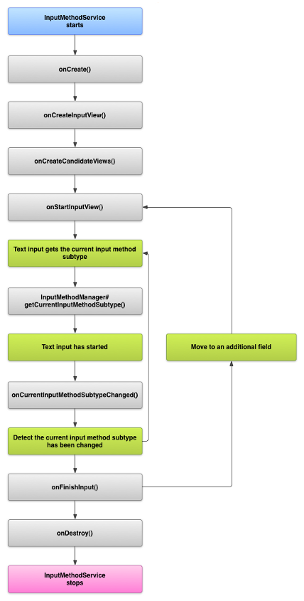

# 输入法 #
若对输入法不了解可以参考下面地址了解下
[https://developer.android.google.cn/guide/topics/text/creating-input-method](https://developer.android.google.cn/guide/topics/text/creating-input-method "Create an input method")
**实现输入法必须重写InputMethodService类，键盘本质上就是一个dialog，所有键盘界面均画在这个界面上，键盘的dialog是frameworks\base\core\java\android\inputmethodservice\SoftInputWindow.java**
## 生命周期 ##
如下图

### 解析 ###
1. 开机第一次启动输入法会执行onCreate onCreateInputView onCreateCandidateViews三个方法，并且这三个方法执行一次，除非重新开机或者切换其它输入法后再重新切回来。
2. 后面再启动输入法走onstartInput->onStartInputView。
3. onCreateInputView回调方法返回的view为键盘界面view，开发者可以自定义键盘界面，通过这个方法返回给系统。
4. onCreateCandiateView返回候选栏视图，重写这个方法可自定义候选视图。

